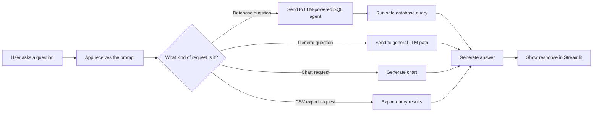

# python-for-ai

## Prompt to answer flow

To load Streamlit UI
python -m streamlit run streamlit_app.py

Trusted-header dev auth test:

```powershell
.\.venv\Scripts\python .\scripts\test_trusted_auth_headers.py --url http://localhost:8501/ --user alice@example.com
```

If `.env.dev` is using trusted-header auth, the app expects:

```text
X-Forwarded-Authenticated: true
X-Authenticated-User: alice@example.com
```

When those headers are missing, anonymous access is only allowed in dev when `APP_ALLOW_ANONYMOUS_DEV_AUTH=true` is explicitly set.

Security defaults:

- `APP_ENABLE_VERBOSE_AGENT_LOGS` must remain disabled outside dev.
- Password auth now enforces a temporary lockout after repeated failures.
- Password-auth sessions expire automatically unless revalidated.
- Outside dev, trusted-header auth must include `APP_TRUSTED_AUTH_HEADER`, `APP_TRUSTED_AUTH_VALUE`, and a distinct `APP_TRUSTED_USER_HEADER`.

Environment template:

- Start from [`.env.example`](e:/Repo/PythonProject/python-for-ai/.env.example) and copy it to `.env.dev` or `.env.prod`.

Deployment checklist:

- Set `APP_ENV=prod` for any real deployment.
- Choose one auth mode only: `APP_PASSWORD` or trusted-header auth.
- If using trusted-header auth outside dev, set `APP_TRUSTED_AUTH_HEADER`, `APP_TRUSTED_AUTH_VALUE`, and `APP_TRUSTED_USER_HEADER` to distinct, proxy-controlled headers.
- Keep `APP_ALLOW_ANONYMOUS_DEV_AUTH=false` outside local development.
- Keep `APP_ENABLE_VERBOSE_AGENT_LOGS=false` outside dev.
- Set `SQL_ALLOWED_TABLES` to the minimum table/view allowlist needed by the app.
- Keep `APP_MAX_EXPORT_ROWS` conservative for your data sensitivity.
- Put Streamlit behind a reverse proxy or gateway that strips inbound auth headers from clients and injects the trusted headers itself.

Local proxy helper:

```powershell
.\.venv\Scripts\python .\scripts\dev_auth_proxy.py --listen-port 8601 --backend-url http://localhost:8501 --user alice@example.com
```

Then browse to `http://127.0.0.1:8601/`.

Note: this helper is intentionally small and only proxies normal HTTP requests. It does not proxy WebSockets, so it is best used as a local smoke-test aid rather than a production-style front end.

High-level view:



The Streamlit app processes a user message in this order:

```mermaid
flowchart TD
	A[User types prompt in Streamlit chat box] --> B[streamlit_app.py: prompt = st.chat_input('Ask a question')]
	B --> C{Prompt empty?}
	C -->|Yes| Z[Return and wait]
	C -->|No| D[Append user message to st.session_state.messages]
	D --> E[Render user message in chat window]
	E --> F[Call run_chat_turn(app, prompt)]

	F --> G{Request type?}
	G -->|Starts with 'export csv '| H[app.export_query_to_csv(sql_query)]
	G -->|Chart request| I[Generate bar or pie chart]
	G -->|Normal question| J[app.ask(question)]

	J --> K{Table-format follow-up?}
	K -->|Yes| L[Reformat last DB answer or ask general LLM to format]
	K -->|No| M{Database question?}

	M -->|No| N[General LLM path via _ask_general(...)]
	M -->|Yes| O{Follow-up question?}
	O -->|Yes| P[Build database follow-up prompt with context]
	O -->|No| Q[Use original question]
	P --> R[self.agent.invoke(question_to_ask)]
	Q --> R

	R --> S[LangChain SQL agent]
	S --> T[Uses create_sql_agent(..., prefix=self._build_agent_prefix())]
	T --> U[LLM decides tool calls against SQLDatabase]
	U --> V[SQLDatabase.run() is guarded by _patch_db_with_guard()]
	V --> W[_validate_query -> SQL safety checks and table allowlist]
	W --> X[Database executes allowed query and returns result]
	X --> Y[Agent produces final text answer]

	H --> AA[Return assistant message]
	I --> AA
	L --> AA
	N --> AA
	Y --> AB{Asked for table format?}
	AB -->|Yes| AC[Convert answer to markdown table if possible]
	AB -->|No| AA
	AC --> AA

	AA --> AD[Save assistant response to chat history]
	AD --> AE[Render assistant content in Streamlit]
	AE --> AF{Image path present?}
	AF -->|Yes| AG[Render chart image]
	AF -->|No| AH[Done]
```

Key code paths:

- `streamlit_app.py` captures the prompt, routes it, and renders the response.
- `app/sql_agent_app.py` decides whether to use the general LLM, SQL agent, export path, or chart path.
- `app/sql_agent_app.py` also applies SQL validation and table allowlist checks before database execution.

## Run tests

## Project layout

- `app/` contains the application logic, config, SQL agent, export helpers, and visualization code.
- `streamlit_app.py` is the active Streamlit entrypoint.
- `scripts/` contains helper and maintenance scripts.
- `docs/architecture/` contains Mermaid diagrams and architecture artifacts.
- `requirements/base.txt` contains runtime dependencies and `requirements/dev.txt` layers on development-only packages.

For the nicest colored output, use `pytest`:

```powershell
.\.venv\Scripts\python -m pytest .\tests -v --color=yes
```

Run the targeted security-related tests with `pytest`:

```powershell
.\.venv\Scripts\python -m pytest .\tests\test_config.py .\tests\test_sql_security.py .\tests\test_streamlit_auth.py -v --color=yes
```

Run one module with `pytest`:

```powershell
.\.venv\Scripts\python -m pytest .\tests\test_streamlit_auth.py -v --color=yes
```

Run one specific test method with `pytest`:

```powershell
.\.venv\Scripts\python -m pytest .\tests\test_streamlit_auth.py -k trusted_header_auth_uses_header_value_as_principal -v --color=yes
```

## Run tests with unittest

From the repository root:

```powershell
.\.venv\Scripts\python .\scripts\run_unittests.py
```

Run the targeted security-related tests:

```powershell
.\.venv\Scripts\python .\scripts\run_unittests.py tests.test_config tests.test_sql_security tests.test_streamlit_auth
```

Run one test module in verbose mode:

```powershell
.\.venv\Scripts\python .\scripts\run_unittests.py tests.test_streamlit_auth
```

Run one specific test method:

```powershell
.\.venv\Scripts\python .\scripts\run_unittests.py tests.test_streamlit_auth.TestStreamlitAuth.test_trusted_header_auth_uses_header_value_as_principal
```

## VS Code task

A VS Code task named `Run pytest suite` is available and runs:

```powershell
.\.venv\Scripts\python -m pytest tests -v --color=yes
```

There are also unittest-based tasks if you want the custom `run_unittests.py` formatting.

A VS Code task named `Run unittest suite` is available and runs:

```powershell
.\.venv\Scripts\python .\scripts\run_unittests.py
```

You can run it from `Terminal: Run Task` in VS Code.
